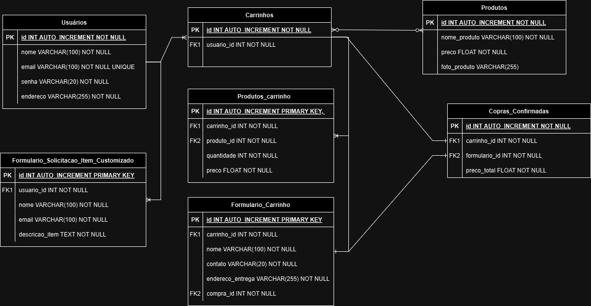
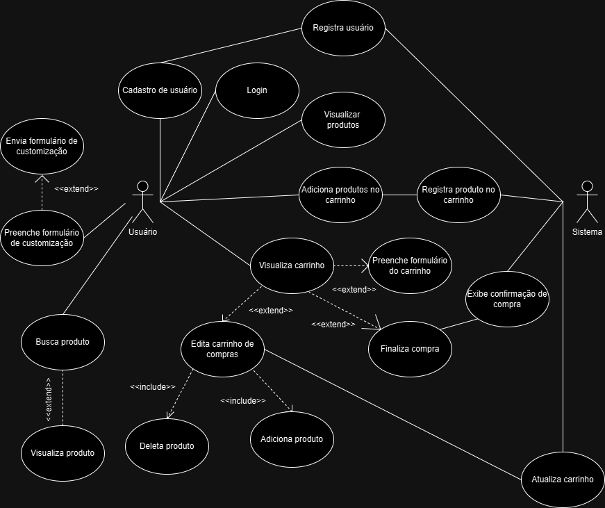

# TailorTech

TailorTech é uma plataforma de e-commerce projetada para customização e compra de itens sob medida. O sistema inclui registro de usuário, navegação de produtos, gerenciamento de carrinho de compras e processamento de pedidos.

## Autores

Este projeto foi desenvolvido por Ana Cristina Pereira Morais e Marcus Vinícius Bitencourt para a matéria de Empreendedor em Informática do curso de Ciência da Computação da Universidade Estadual de Santa Cruz (UESC).

## Índice

- [Esquema do Banco de Dados](#esquema-do-banco-de-dados)
- [Tabelas](#tabelas)
- [Diagrama de Caso de Uso](#diagrama-de-caso-de-uso)
- [Instruções de Configuração](#instruções-de-configuração)
- [Uso](#uso)
- [Pasta TAREFAS](#pasta-TAREFAS)

## Esquema do Banco de Dados

O esquema do banco de dados para TailorTech é ilustrado no diagrama a seguir:



### Tabelas

- **Usuários**: Armazena informações dos usuários, incluindo nome, email, senha e endereço.
- **Carrinhos**: Contém informações sobre os carrinhos de compras dos usuários.
- **Produtos**: Lista produtos disponíveis para compra.
- **Produtos_Carrinho**: Tabela de junção que conecta produtos e carrinhos de compras, com detalhes de quantidade e preço.
- **Formulario_Solicitacao_Item_Customizado**: Armazena formulários de solicitação de itens personalizados enviados pelos usuários.
- **Formulario_Carrinho**: Contém dados de formulários relacionados a pedidos do carrinho de compras.
- **Compras_Confirmadas**: Rastreia compras confirmadas.

## Diagrama de Caso de Uso

O diagrama de caso de uso abaixo representa as interações entre os usuários e o sistema, detalhando as várias funcionalidades fornecidas pelo TailorTech.



## Instruções de Configuração

1. Clone o repositório:
    ```bash
    git clone https://github.com/mvbitencourt/tailortech.git
    ```
2. Navegue até o diretório do projeto:
    ```bash
    cd tailortech
    ```
3. Instale as dependências:
    ```bash
    npm install
    ```
4. Configure o banco de dados:
    - Crie as tabelas necessárias conforme ilustrado no esquema do banco de dados.
    - Configure as configurações de conexão do banco de dados no aplicativo.

5. Inicie o servidor de desenvolvimento:
    ```bash
    npm run dev
    ```

## Uso

- **Registro de Usuário**: Os usuários podem se inscrever e fazer login em suas contas.
- **Navegação de Produtos**: Os usuários podem visualizar e pesquisar produtos.
- **Gerenciamento de Carrinho de Compras**: Os usuários podem adicionar, editar e remover produtos do carrinho de compras.
- **Processamento de Pedidos**: Os usuários podem preencher formulários de carrinho e confirmar suas compras.


## Pasta TAREFAS

A pasta `TAREFAS` contém arquivos importantes para o desenvolvimento e a documentação do projeto. Abaixo está uma descrição dos arquivos presentes nesta pasta:

- **Diagrama_ER.png**: Este arquivo apresenta o diagrama de entidade-relacionamento (ER) que ilustra a estrutura do banco de dados do projeto TailorTech.
- **Casos_de_uso.png**: Este arquivo apresenta o diagrama de casos de uso, mostrando as interações entre os usuários e o sistema.
- **modelo de front-end**: Este arquivo contém o modelo de front-end do projeto feito na plataforma Mobirise.
- **Plano de negócio**: Este arquivo contém o plano de negócios do nosso e-commerce feito de acordo com as normas do SEBRAE.
- **TailorTech_Canvas**: Este arquivo contém o Canvas do nosso e-commerce.
- **E-commerce de periféricos personalizáveis**: Este arquivo contém o projeto de fundação do nosso e-commerce.
